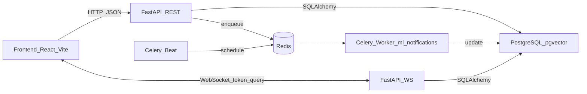

## ZebraPoint — wprowadzenie techniczne

ZebraPoint to platforma wsparcia dla opiekunów osób z rzadkimi chorobami. Kluczowy pomysł MVP to **dopasowanie użytkownika do małej grupy** na podstawie krótkiego opisu objawów/sytuacji, a następnie udostępnienie narzędzi komunikacji: **czat grupowy**, **forum grupy** i **wiadomości prywatne (DM)**.

Poniżej znajdziesz opis: jak aplikacja jest zbudowana, jakie mechanizmy są użyte oraz gdzie w kodzie szukać konkretnych elementów.

---

## Architektura (wysoki poziom)

- **Frontend**: React 19 + Vite + TailwindCSS 4 (SPA)
- **Backend**: FastAPI + SQLAlchemy 2.0 + Pydantic v2 (REST + WebSocket)
- **Baza**: PostgreSQL (Supabase) + **pgvector** na embeddingi
- **Kolejki/zadania tła**: Celery + Redis (ML i powiadomienia)

Technologie w skrócie (najważniejsze biblioteki):
- **Backend**: FastAPI, SQLAlchemy 2.0, Pydantic v2, `python-jose` (JWT), `bcrypt` (hash haseł), `pgvector` (wektory), `sentence-transformers` + `torch` (embeddingi), scikit-learn + HDBSCAN (pipeline ML), Celery + Redis (zadania tła).
- **Frontend**: React, React Router, Zustand, Axios, TailwindCSS, react-hook-form + Zod (formularze i walidacja), react-hot-toast (komunikaty).

Schemat komunikacji:

Główne punkty wejścia:
- Backend startuje w `backend/app/main.py` (rejestracja routerów + CORS + wczytanie modelu embeddingów w lifespan).
- Frontend startuje w `frontend/src/main.jsx` i routuje w `frontend/src/App.jsx`.

---

## Najważniejsze moduły funkcjonalne

### 1) Autoryzacja (JWT) i użytkownicy

- **Rejestracja / logowanie**: `backend/app/routers/auth.py`
  - `POST /auth/register`
  - `POST /auth/login` → zwraca `access_token`
  - `GET /auth/me` → dane zalogowanego użytkownika
- **JWT**: tworzenie i weryfikacja w `backend/app/auth/jwt.py`
- **Dependency do ochrony endpointów**: `backend/app/auth/dependencies.py`
  - `get_current_user` (weryfikacja tokenu Bearer)
  - `get_current_active_user` (dodatkowo kontrola bana i auto-odbanowanie po czasie)
  - `require_admin` (wymagana rola `admin`)

Po stronie frontendu:
- Token jest trzymany w `localStorage` pod kluczem `zp_token` (`frontend/src/store/authStore.js`).
- Axios automatycznie dopina `Authorization: Bearer <token>` i obsługuje błędy (np. 401 czyści token i przenosi na `/login`) w `frontend/src/services/api.js`.
- Ochrona tras działa przez `frontend/src/components/ProtectedRoute.jsx`.

### 2) Profil objawów → embedding → dopasowanie do grup

To jest serce MVP.

Flow (z perspektywy API):
1. Użytkownik wysyła opis w `POST /symptoms/` (`backend/app/routers/symptoms.py`).
2. Backend generuje **embedding** tekstu przez `sentence-transformers`:
   - `backend/app/services/embedding_service.py`
   - model: `paraphrase-multilingual-MiniLM-L12-v2` (multilingual, 384 wymiary), ładowany jako singleton
3. Embedding zapisywany jest w bazie jako wektor (`pgvector`) w tabeli profili objawów.
4. Dopasowanie szuka TOP‑K najbliższych embeddingów w bazie (cosine distance przez operator pgvector `<=>`, przeliczone na similarity) i wybiera grupę:
   - `backend/app/services/matching_service.py`
   - próg: `SIMILARITY_THRESHOLD = 0.72`
5. Jeśli nie ma sensownego dopasowania → tworzy się **nowa grupa tymczasowa**.

Ważne: zapytanie podobieństwa używa operatora pgvector `<=>` (cosine distance). W kodzie jest to przeliczane na similarity:
`similarity = 1 - distance` (patrz `_query_similar_profiles()` w `matching_service.py`).

### 3) Grupy (dostęp tylko dla członków)

- `GET /groups/me` → moja grupa (na podstawie profilu objawów)
- `GET /groups/{group_id}` → szczegóły (wymaga członkostwa)
- `GET /groups/{group_id}/members` → lista członków

Kod: `backend/app/routers/groups.py`.

### 4) Czat grupowy (WebSocket) + historia (REST)

- WebSocket: `GET ws://.../ws/chat/{group_id}?token=...`
  - auth przez token w query (WebSocket nie używa nagłówka Bearer tak jak REST)
  - weryfikacja członkostwa w grupie
  - po połączeniu wysyłana jest historia ostatnich wiadomości
  - kod: `backend/app/routers/chat.py` + `backend/app/websocket/chat_manager.py`
- REST (historia z paginacją): `GET /groups/{group_id}/messages`

### 5) Wiadomości prywatne (DM)

Są dwie ścieżki:
- **REST** (lista konwersacji i fallback do wysyłki):
  - `GET /dm/conversations`
  - `GET /dm/conversations/{conversation_id}/messages`
  - `POST /dm/conversations/{conversation_id}/messages` (fallback gdy WS niedostępny)
  - `POST /dm/start` (utwórz lub pobierz konwersację)
  - kod: `backend/app/routers/dm.py`
- **WebSocket** (główna komunikacja):
  - `GET ws://.../ws/dm/{conversation_id}?token=...`
  - typy wiadomości: `ping/pong`, `message`, `read`
  - kod: `backend/app/routers/dm_ws.py` + `backend/app/websocket/dm_manager.py`

### 6) Forum grupy (posty, komentarze, reakcje)

Endpointy są pod prefiksem `"/groups"` (w routerze forum), np.:
- `GET /groups/{group_id}/posts`
- `POST /groups/{group_id}/posts`
- `GET /groups/{group_id}/posts/{post_id}`
- komentarze i reakcje (toggle) na posty/komentarze

Kod: `backend/app/routers/forum.py`.  
Ważne: jest wymuszenie członkostwa (`_require_membership`).

### 7) Zgłoszenia i moderacja + panel admina

- Zgłoszenia treści: `POST /reports/` w `backend/app/routers/reports.py`
  - użytkownik może zgłosić: post/komentarz/wiadomość/użytkownika
  - zbanowany użytkownik nie może zgłaszać
- Panel admina: `backend/app/routers/admin.py`
  - kolejka zgłoszeń + akcje moderacyjne (warn/ban/delete/dismiss)
  - narzędzia ML/Redis (ping redis, trigger retrain, status pipeline)
  - moderacja postów (pin/lock)

---

## Zadania tła (Celery + Redis)

Celery jest skonfigurowane w `backend/app/tasks/celery_app.py`.

- Są osobne kolejki:
  - `ml` (pipeline ML, przeliczanie charakterystyk grup)
  - `notifications` (powiadomienia; część jest stubem)
  - `default`
- Beat (harmonogram):
  - co 30 minut sprawdza warunek retrain (`check_and_retrain`)
- Implementacja ML zadań:
  - `backend/app/tasks/ml_tasks.py`
- Powiadomienia (na razie stub / placeholder):
  - `backend/app/tasks/notification_tasks.py`

---

## Konfiguracja (ENV) i integracje

### Backend (FastAPI)

Plik konfiguracji: `backend/app/config.py` (Pydantic Settings, wczytuje `backend/.env`).

Najważniejsze zmienne (zobacz też `backend/.env.example`):
- `DATABASE_URL` — connection string do Postgres (Supabase)
- `SECRET_KEY` — klucz do podpisywania JWT
- `ALGORITHM` — domyślnie `HS256`
- `ACCESS_TOKEN_EXPIRE_MINUTES`
- `REDIS_URL`
- `ENVIRONMENT`, `DEBUG`

Uwaga praktyczna: w `backend/app/database.py` jest mechanizm podmiany hosta na IPv4, żeby uniknąć problemów gdy środowisko nie ma IPv6 (dotyczy niektórych adresów Supabase).

### Frontend (React)

- `VITE_API_URL` — base URL do REST (domyślnie `http://localhost:8000`)
- `VITE_WS_URL` — base URL do WebSocket (ustawiane m.in. w CI dla produkcji)

Axios klient: `frontend/src/services/api.js`.

---

## Jak uruchomić projekt

### Opcja A — najprostszy dev (Docker Compose: backend+frontend)

W repo jest `docker-compose.yml` (backend na uvicorn `--reload`, frontend `npm run dev`):

- Backend: `http://localhost:8000` (Swagger: `/docs`)
- Frontend: `http://localhost:5173`

### Opcja B — dev z workerem/beat (Redis + Celery w Dockerze)

`docker-compose.dev.yml` uruchamia:
- `redis`
- `worker` (Celery)
- `beat` (Celery Beat)

Backend i frontend możesz wtedy uruchamiać lokalnie (poza Dockerem), a kolejki będą działały w kontenerach.

### Produkcja (Docker Compose)

`docker-compose.prod.yml` uruchamia pełny zestaw:
- `nginx` (reverse proxy)
- `frontend` (obraz z GHCR)
- `backend` (obraz z GHCR)
- `redis`, `worker`, `beat`

CI: `.github/workflows/build.yml` buduje i wypycha obrazy do GHCR oraz przekazuje `VITE_API_URL` i `VITE_WS_URL` do buildu frontendu.

---

## Kluczowe rozwiązania (dlaczego tak)

- **pgvector w Postgres (Supabase)**: embeddingi są przechowywane i wyszukiwane w tej samej bazie co reszta danych aplikacji (mniej infrastruktury na MVP).
- **WebSocket z tokenem w query (`?token=...`)**: prosty sposób autoryzacji połączeń WS dla czatu i DM (w REST token idzie standardowo w nagłówku Bearer).
- **Axios interceptors na froncie**: automatyczne dopinanie tokenu oraz spójna obsługa błędów (np. 401 → wylogowanie i przekierowanie do `/login`).
- **Celery + Redis**: rzeczy cięższe lub okresowe (ML/powiadomienia) są przeniesione poza cykl request→response, żeby nie spowalniać użytkownika.

## Mapa kodu (gdzie szukać czego)

### Backend (`backend/app/`)

- `main.py` — FastAPI app, routery, CORS, startup (model embeddingów)
- `routers/` — endpointy REST i WS (auth, symptoms, groups, chat, dm, forum, reports, admin)
- `auth/` — JWT i zależności autoryzacji
- `services/` — logika biznesowa (embeddingi, matching, pipeline ML, charakterystyki grup)
- `models/` — modele SQLAlchemy
- `schemas/` — schemy Pydantic (request/response)
- `tasks/` — Celery (worker/beat), zadania ML i notyfikacji
- `websocket/` — managerowie połączeń WebSocket (czat i DM)

### Frontend (`frontend/src/`)

- `App.jsx` — routing (publiczne, chronione, admin)
- `pages/` — strony (dashboard, grupy, forum, wiadomości)
- `components/` — komponenty UI i funkcjonalne (np. czat, forum)
- `store/` — Zustand (np. `authStore.js`)
- `services/` — klient API (axios)
- `hooks/` — hooki do fetchowania/zarządzania stanem domenowym

